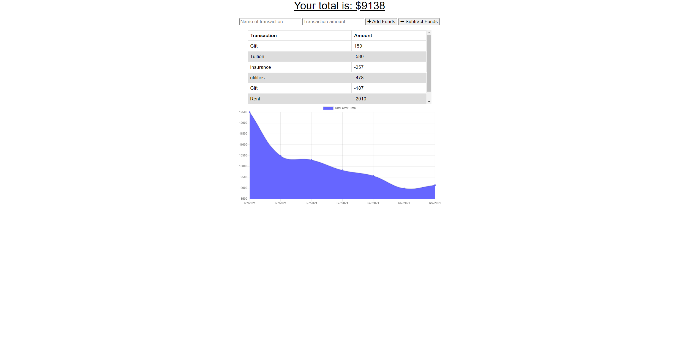

# Budget Tracker App  [](https://opensource.org/licenses/MIT)
## Description
This is an app to keep track of depoists and withdrawals. Its created using express.js and mongoDb. It also uses Progressive Web Applications such as Web Manifest, service worker and IndexedDB to add offline functionality.

## Built Using
JavaScript, ES6, Node.js (Express, Mongoose, compression), MongoDB and PWAs (Web Manifest, Service worker, IndexedDB)

## Table of Contents
* [Installation](#Installation)
* [Usage](#Usage)
* [User-Story](#User-Story)
* [Acceptance-Criteria](#Acceptance-Criteria)
* [License](#License)
* [Contributing](#Contributing)
* [Screenshot](#Screenshot)
* [Deployed](#Deployed)
* [Questions](#Questions)

### Installation
To clone the repo run ```git clone https://github.com/vsjanarthani/Budget-Tracker-PWA.git```. Inorder to install the necessary dependencies, run ```npm install``` in your terminal.

### Usage
After installing all the dependencies, run ```npm start``` in your terminal to start the server. 
### User-Story
AS AN avid traveler<br>
I WANT to be able to track my withdrawals and deposits with or without a data/internet connection<br>
SO THAT my account balance is accurate when I am traveling <br>

### Acceptance-Criteria
GIVEN a budget tracker without an internet connection <br>
WHEN the user inputs an expense or deposit <br>
THEN they will receive a notification that they have added an expense or deposit <br>
WHEN the user reestablishes an internet connection <br>
THEN the deposits or expenses added while they were offline are added to their transaction history and their totals are updated <br>
### License
This application is covered under **MIT** license.

### Contributing 
No contributions at the moment. If anyone wishes to provide contributions, please contact the author.

### Screenshot


### Deployed
The application is deployed on Heroku [https://budget-tracker-jana.herokuapp.com/](https://budget-tracker-jana.herokuapp.com/)

### Questions
If you have any questions, please reach out to the<br>
Author: Janarthani V S <br>
Email : <vs.janarthani@gmail.com> <br>
Author's github profile: [GitHub](https://github.com/vsjanarthani)
